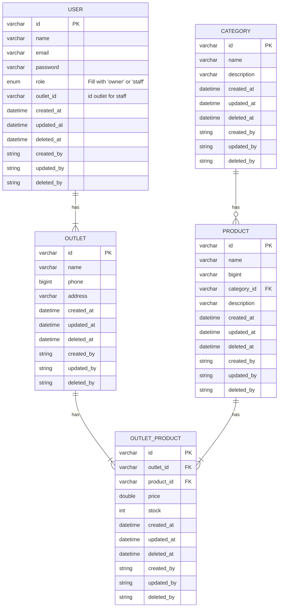

ERD : Mini POS 

```mermaid
erDiagram
    USER ||--|{ OUTLET : has
    USER {
        varchar id PK
        varchar name
        varchar email
        varchar password
        enum role "Fill with 'owner' or 'staff'"
        varchar outlet_id "id outlet for staff"
        datetime created_at
        datetime updated_at
        datetime deleted_at
        string created_by
        string updated_by
        string deleted_by
    }
    OUTLET ||--|{ OUTLET_PRODUCT : has
    OUTLET {
        varchar id PK
        varchar name
        bigint phone
        varchar address
        datetime created_at
        datetime updated_at
        datetime deleted_at
        string created_by
        string updated_by
        string deleted_by
    }
    CATEGORY ||--o{ PRODUCT : has
    CATEGORY {
        varchar id PK
        varchar name
        varchar description
        datetime created_at
        datetime updated_at
        datetime deleted_at
        string created_by
        string updated_by
        string deleted_by
    }
    PRODUCT ||--|{ OUTLET_PRODUCT : has
    PRODUCT {
        varchar id PK
        varchar name
        varchar bigint
        varchar category_id FK
        varchar description
        datetime created_at
        datetime updated_at
        datetime deleted_at
        string created_by
        string updated_by
        string deleted_by
    }
    OUTLET_PRODUCT
    OUTLET_PRODUCT {
        varchar id PK
        varchar outlet_id FK
        varchar product_id FK
        double price
        int stock
        datetime created_at
        datetime updated_at
        datetime deleted_at
        string created_by
        string updated_by
        string deleted_by
    }
```