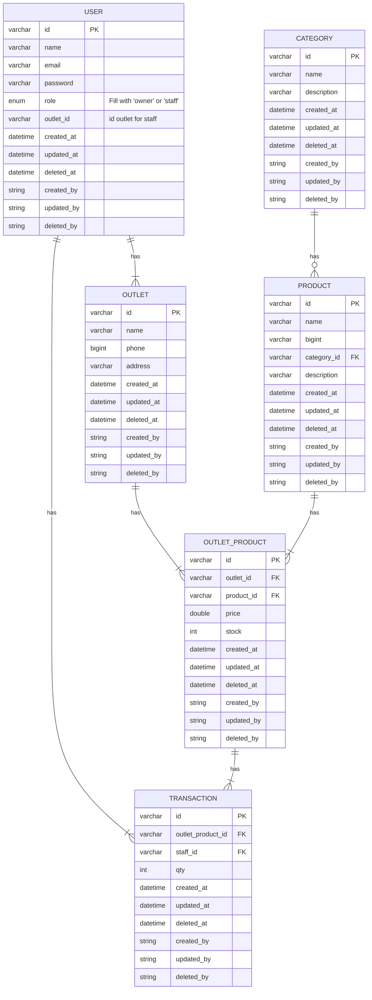
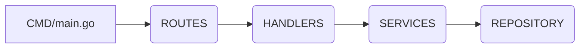

# API Mini POS - Golang

API Mini POS ini terdiri dari 6 Resource :

- Users
- Outlets
- Categories
- Products
- Outlet Products
- Transactions

## 1. Set Up Project

- Clone this repository
- Pindahkan file `.env.example` ke dalam folder cmd
- Sesuaikan konfigurasi yang terdapat pada file `.env.example`
- Rename file `.env.example` menjadi `.env`
- Jalankan perintah
  ```
  go mod tidy
  ```

## 2. Run Project

- Go to root folder
- Jalankan perintah
  ```
  go run ./cmd/main.go
  ```
- Server akan berjalan pada `http://localhost:8000`

## 3. ERD Mini POS



## 4. Architecture

### 4.1 Main Layer



- **CMD/main.go:** merupakan file utama yang dieksekusi untuk menjalankan golang
- **ROUTES:** layer yang bertugas untuk mengatur / mapping endpoint
- **HANDLERS:** layer yang bertugas untuk menerima input (request data) dan memberikan output (response data)
- **SERVICES:** layer yang bertugas untuk mengolah bisnis logic berdasarkan request data yang diterima dari layer handler
- **REPOSITORIES:** layer yang bertugas untuk mengolah data dari dan ke dalam database

### 4.2 Support Layer

- **HELPERS:** Kumpulan function global yang bisa dipanggil dari semua Main Layer
- **MIDDLEWARES:** Kumpulan function yang dieksekusi sebelum menjalankan layer Handlers
- **PKG:** Kumpulan function sistem yang tidak digunakan pada Main Layer
- **PORTS:** Kumpulan interface untuk abstraksi manipulasi data pada database
- **MODELS:** Kumpulan struct yang merepresentasikan struktur table pada database
- **SCHEMAS:** Kumpulan struct yang merepresentasikan request payload dan response payload

## 5. API List
[See Full Api Documentation / Payload Contract Here](https://cahkampung052.github.io/mini-pos-doc/)
- **Auth**
  - POST api/v1/login
- **User**
  - POST api/v1/users
  - GET api/v1/users
  - GET api/v1/users/:id
  - PUT api/v1/users/:id
  - DELETE api/v1/users/:id
- **Outlet**
  - POST api/v1/outlet
  - GET api/v1/outlet
  - GET api/v1/outlet/:id
  - PUT api/v1/outlet/:id
  - DELETE api/v1/outlet/:id
- **Category**
  - POST api/v1/category
  - GET api/v1/category
  - GET api/v1/category/:id
  - PUT api/v1/category/:id
  - DELETE api/v1/category/:id
- **Product**
  - POST api/v1/product
  - GET api/v1/product
  - GET api/v1/product/:id
  - PUT api/v1/product/:id
  - DELETE api/v1/product/:id
- **Transaction**
  - POST api/v1/transaction
  - GET api/v1/transaction
  - GET api/v1/transaction/:id
  - PUT api/v1/transaction/:id
  - DELETE api/v1/transaction/:id

Untuk mengakses api via swagger-ui `http://localhost:8000/swagger`
